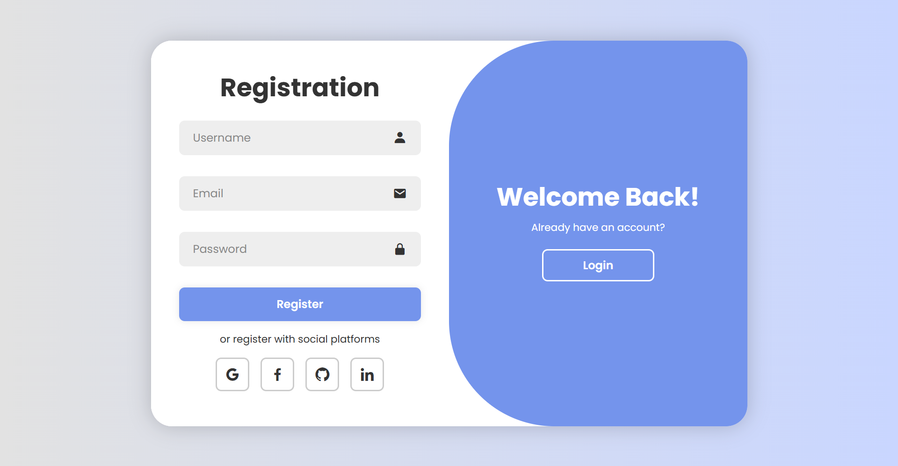

# Signup & Login Form

Proyek antarmuka **Signup & Login Form** modern dan responsif menggunakan **HTML, CSS, dan JavaScript**.  
Menampilkan form Login dan Register dalam satu halaman dengan animasi toggle tanpa reload.

## ✨ Fitur
- Login & Register dalam satu halaman
- Animasi transisi toggle form
- Desain modern dan responsif
- Ikon menggunakan Boxicons
- Tanpa framework (pure HTML, CSS, JavaScript)

## 🛠️ Teknologi
- HTML5  
- CSS3  
- JavaScript (Vanilla JS)  
- Google Fonts (Poppins)  
- Boxicons  

## 📁 Struktur Folder
```
signup-login-form/
├── SignUp_LogIn_Form.html
├── SignUp_LogIn_Form.css
└── SignUp_LogIn_Form.js
```

## 🚀 Cara Menjalankan
1. Clone repository:
```
git clone https://github.com/aghni37/signup-login-form.git
```
2. Masuk ke folder project:
```
cd signup-login-form
```
3. Buka file `SignUp_LogIn_Form.html` di browser.

## ⚙️ Cara Kerja
- Tombol **Register** menambahkan class `active` pada `.container`
- Tombol **Login** menghapus class `active`
- CSS mengatur animasi dan perubahan layout berdasarkan class tersebut

## 📸 Preview
```



```

## 📌 Catatan
- Project ini hanya UI (belum terhubung backend)
- Cocok untuk latihan frontend atau template autentikasi

## 📄 Lisensi
Bebas digunakan untuk pembelajaran dan pengembangan pribadi.
